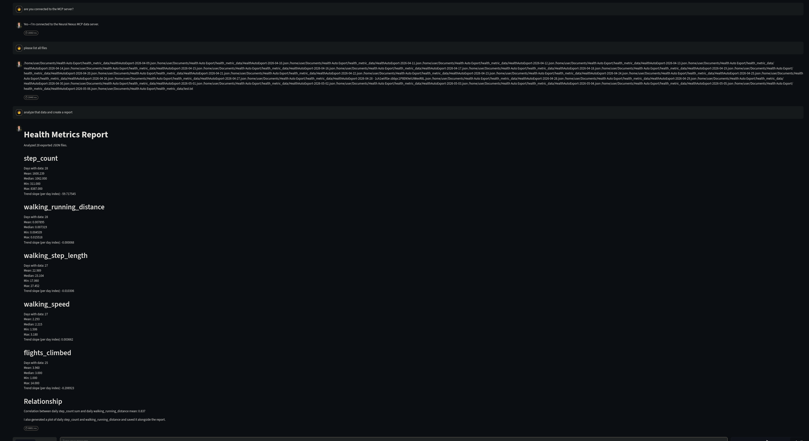

# NeuralNexus MCP (macOS)

Share folders on your Mac with [NeuralNexus](https://neuralnexus.site) to allow your Avatar to read and analyze your local files from your desktop! Have on demand health analytics from Apple Health! Learn detailed insights in seconds! Receive alerts and notifications based on this health data in the future!



This app runs a small **Model Context Protocol (MCP)** server on your computer and connects to `api.neuralnexus.site` over an **outbound** connection. You do **not** need:

- a tunnel service or extra accounts
- port forwarding
- inbound firewall rules
- a public IP

Your files stay on your machine. The API reaches them only through the secure relay you open outward.

---

## Who this is for

| Audience | What you get |
|----------|----------------|
| **Users** | Double-click install, pick a folder, leave it running in the background |
| **Developers** | Local MCP + relay against production or a local Anubis API |

---

## Requirements

- macOS 13 (Ventura) or later
- A NeuralNexus account and API key (`sk-...`) from Account settings — [Signup Here](https://api.neuralnexus.site/docs#POST/signup)
- Network access to `api.neuralnexus.site` (HTTPS / WSS)

You do **not** need to install Python yourself. If your Mac does not already have Python 3.11+, the installer downloads a private copy for this app only — it does not change your system Python.

---

## Quick start (users)

### 1. Get the project

Download this project and unzip it, or:

```bash
git clone https://github.com/AfterlifeSystems/anubis-mcp-server-mac-os.git
cd anubis-mcp-server-mac-os
```

### 2. Install — double-click

In Finder, double-click:

```
Install NeuralNexus MCP.command
```

It opens Terminal and walks you through setup. On first launch you will be asked for:

1. **API key** — your NeuralNexus `sk-...` key
2. **Folder to share** — a directory the AI may read (a sensible default is suggested when available, e.g. Health Auto Export data)

> **First time only:** macOS may say the file is from an unidentified developer. Right-click the file → **Open** → **Open**, or allow it under **System Settings → Privacy & Security**.

> **Permission prompts:** macOS asks before any app reads Documents, Downloads, or Desktop. Click **Allow** when prompted, otherwise NeuralNexus cannot read the folder you chose. See [macOS privacy permissions](#macos-privacy-permissions-tcc).

Terminal users can run the same thing with:

```bash
./neuralnexus-mcp.sh install
```

### 3. Confirm it is running

```bash
./neuralnexus-mcp.sh status
```

That is it. The daemon:

- listens on `127.0.0.1` only (not exposed to the internet)
- opens an outbound WebSocket to `wss://api.neuralnexus.site/mcp/relay`
- registers with NeuralNexus using your API key
- proxies tool calls from the API to your local MCP server

After install it runs as a **launchd LaunchAgent** (`com.neuralnexus.mcp`) and starts when you log in.

---

## Day-to-day commands

Run with no arguments for an interactive menu:

```bash
./neuralnexus-mcp.sh
```

Or use commands directly:

| Command | What it does |
|---------|----------------|
| `./neuralnexus-mcp.sh install` | Install dependencies, first-time setup, start the LaunchAgent |
| `./neuralnexus-mcp.sh start` | Start the service |
| `./neuralnexus-mcp.sh stop` | Stop the service |
| `./neuralnexus-mcp.sh restart` | Restart the service |
| `./neuralnexus-mcp.sh status` | Show service and config status |
| `./neuralnexus-mcp.sh logs` | Follow live logs |
| `./neuralnexus-mcp.sh uninstall` | Remove the LaunchAgent |
| `./neuralnexus-mcp.sh uninstall --purge` | Also remove `.venv`, saved config, and logs |

Equivalent scripts:

```bash
./scripts/install.sh
./scripts/stop.sh
./scripts/uninstall.sh
./scripts/uninstall.sh --purge
```

### Logs

```bash
./neuralnexus-mcp.sh logs
# or
tail -f ~/Library/Logs/neuralnexus-mcp/daemon.log
```

### While you are logged out

A LaunchAgent runs only while you are logged in, and pauses while the Mac sleeps — this is normal macOS behavior, and there is no macOS equivalent of `loginctl enable-linger`. To keep a long analysis running, keep the Mac awake with `caffeinate -i` or **System Settings → Displays → Advanced → Prevent automatic sleeping**.

`stop` also unloads the agent, so it stays stopped until you run `start` again — including across a reboot.

### Share more folders

You can share any number of folders. The easiest way is the manager script, which updates the config and restarts the service for you:

```bash
./neuralnexus-mcp.sh folders                          # list shared folders
./neuralnexus-mcp.sh add-folder ~/Documents ~/Downloads
./neuralnexus-mcp.sh remove-folder ~/Downloads
```

The same options are available under "Shared folders" in the interactive menu (`./neuralnexus-mcp.sh`).

### Change settings later

```bash
# Activate the venv first if needed
source .venv/bin/activate

python -m src.daemon configure --watch /replace/all/folders
python -m src.daemon configure --add-watch /path/to/another/folder
python -m src.daemon configure --remove-watch /path/to/another/folder
python -m src.daemon status
python -m src.daemon login --api-key sk-...
```

Config lives in `~/.config/neuralnexus-mcp/`.
Optional production overrides can go in `.env` at the repo root (see `.env.example`).

---

## macOS privacy permissions (TCC)

macOS gates access to `~/Documents`, `~/Desktop`, `~/Downloads`, and iCloud Drive behind per-app consent.

- **Run the installer from Finder or Terminal the first time.** The consent prompt is attributed to the app that launched the daemon, so installing from a visible session gets you a prompt you can actually click.
- **If tool calls fail with permission errors** after a reboot or login, grant **Full Disk Access** to Terminal (or to `<repo>/.venv/bin/python3.12`) under **System Settings → Privacy & Security → Full Disk Access**, then `./neuralnexus-mcp.sh restart`.
- **iCloud Drive:** files that show a cloud icon in Finder are "dataless" placeholders and are not on disk yet. `read_file_bytes` may stall or fail on them until macOS downloads the file — open the folder in Finder and let it sync, or turn off **Optimize Mac Storage** for that folder.
- Sharing a folder outside the home directory (an external drive, for example) needs the drive mounted before the daemon starts; a folder that disappears is dropped from the shared list until it comes back.

---

## Non-interactive / scripted install

Useful for automation or managed machines:

```bash
export NEURALNEXUS_API_KEY=sk-...
export NEURALNEXUS_WATCH_FOLDER="/path/to/your/data"
./scripts/install.sh
```

Or:

```bash
source .venv/bin/activate   # after deps are installed
python -m src.daemon setup --non-interactive \
  --api-key sk-... \
  --watch /path/to/data \
  --start
```

---

## How it works (simple picture)

```
Your Mac                        NeuralNexus API
┌──────────────────────┐        ┌───────────────────────┐
│ Local MCP (127.0.0.1)│◄───────│  Outbound WebSocket   │
│ Shared folder(s)     │  relay │  api.neuralnexus.site │
└──────────────────────┘        └───────────────────────┘
         ▲
         │ only localhost
         │ (not open to the internet)
```

1. You choose which folder(s) to share.
2. MCP serves tools over HTTP on localhost.
3. The daemon keeps an outbound relay open to the API.
4. When NeuralNexus needs your files, the API sends requests through that relay only.

### Connection modes (developer instructions)

| Mode | When to use |
|------|-------------|
| `relay` (default) | Normal use — outbound WebSocket only |
| `local` | Development on the same machine as the API |

Switch modes:

```bash
source .venv/bin/activate
python -m src.daemon configure --connection-mode local
```

The `relay` option works without configuration.

---

## Local development (developers)

Dev mode is **separate** from production: different LaunchAgent, config directory, port, and env file. It does **not** modify production `.env` or `~/.config/neuralnexus-mcp/`.

Production and dev can run at the same time.

### Setup

```bash
cp .env.dev.example .env.dev
# Edit .env.dev — defaults point at a local Anubis API
```

Defaults in `.env.dev.example`:

| Setting | Default |
|---------|---------|
| API | `http://localhost:8123` |
| MCP port | `9990` |
| Config dir | `~/.config/neuralnexus-mcp-dev` |
| LaunchAgent | `com.neuralnexus.mcp.dev` |
| Logs | `~/Library/Logs/neuralnexus-mcp-dev/daemon.log` |

Optional non-interactive keys in `.env.dev`:

```bash
# NEURALNEXUS_API_KEY=sk-...
# NEURALNEXUS_WATCH_FOLDER=/path/to/test/data
```

### Development helper scripts

```bash
./scripts/dev.sh start
./scripts/dev.sh status
./scripts/dev.sh logs
./scripts/dev.sh stop
./scripts/dev.sh restart
```

### Foreground MCP only (no daemon / relay)

```bash
source .venv/bin/activate
MCP_REQUIRE_DEVICE_AUTH=false python -m src.server.app
```

For full daemon + relay against a local Anubis instance, prefer `./scripts/dev.sh`.

### Daemon CLI (advanced)

```bash
source .venv/bin/activate

python -m src.daemon setup          # interactive first-time config
python -m src.daemon start          # MCP + relay in the foreground
python -m src.daemon status
python -m src.daemon configure
python -m src.daemon login
```

### Tests

```bash
.venv/bin/pip install -r requirements.dev.txt
.venv/bin/python -m pytest tests/ -v
```

---

## API contract (Anubis / backend developers)

The local daemon expects these endpoints on the API:

| Endpoint | Purpose |
|----------|---------|
| `WSS /mcp/relay` | Outbound relay; API sends `proxy` messages, daemon returns `proxy_response` |
| `POST /mcp/register` | HTTP registration / pending consent |
| `POST /mcp/heartbeat` | Keep-alive (every ~30s) |
| `POST /mcp/unregister` | Clean shutdown |

### Relay registration (WebSocket)

```json
{
  "type": "register",
  "connection_mode": "relay",
  "device_id": "...",
  "device_secret": "mcp_dev_...",
  "server_name": "macOS-Filesystem",
  "transport": "streamable_http",
  "allowed_roots": ["/absolute/path"],
  "local_mcp_url": "http://127.0.0.1:8000"
}
```

### HTTP registration (`connection_mode: relay`)

```json
{
  "connection_mode": "relay",
  "transport": "relay",
  "mcp_url": "https://api.neuralnexus.site/mcp/relay/<device_id>",
  "device_secret": "mcp_dev_...",
  "device_id": "...",
  "allowed_roots": ["/absolute/path"],
  "server_name": "macOS-Filesystem"
}
```

---

## Uninstall

Double-click `Uninstall NeuralNexus MCP.command` in Finder, or:

```bash
# Remove the service only (keep venv + config)
./neuralnexus-mcp.sh uninstall

# Remove service, virtualenv, config, and logs
./neuralnexus-mcp.sh uninstall --purge
```

Dev service (if you used it):

```bash
./scripts/dev.sh stop
launchctl bootout "gui/$(id -u)/com.neuralnexus.mcp.dev" 2>/dev/null
rm -f ~/Library/LaunchAgents/com.neuralnexus.mcp.dev.plist
```

---

## Troubleshooting

| Problem | What to try |
|---------|-------------|
| Installer will not open (unidentified developer) | Right-click `Install NeuralNexus MCP.command` → **Open** → **Open** |
| Install asks for API key / folder every time | Check that `~/.config/neuralnexus-mcp/` was written and is readable |
| Service will not start | `./neuralnexus-mcp.sh status` and `./neuralnexus-mcp.sh logs` |
| Tool calls return permission errors | Grant **Full Disk Access** (see [macOS privacy permissions](#macos-privacy-permissions-tcc)), then `./neuralnexus-mcp.sh restart` |
| Reading iCloud files hangs or fails | The file is not downloaded yet — open it in Finder, or disable **Optimize Mac Storage** |
| Stops when you log out | Expected — a LaunchAgent runs only while you are logged in |
| `launchctl` errors about the domain | Run from a logged-in macOS session, not a bare SSH shell |
| Dev vs prod confusion | Prod: `./neuralnexus-mcp.sh` + `.env` + `~/.config/neuralnexus-mcp/` · Dev: `./scripts/dev.sh` + `.env.dev` + `~/.config/neuralnexus-mcp-dev/` |

---

## Project layout (high overview)

```
Install NeuralNexus MCP.command    # Double-click installer for non-developers
Uninstall NeuralNexus MCP.command  # Double-click uninstaller
neuralnexus-mcp.sh                 # Main user entrypoint (menu + commands)
scripts/                           # install, stop, uninstall, dev helpers, launchd lifecycle
src/daemon/                        # Setup, relay, registration
src/server/                        # Local MCP HTTP server
.env.example                       # Optional production overrides
.env.dev.example                   # Local Anubis / dev template
```

---

## Reference Documentation

- [LangChain MCP docs](https://docs.langchain.com/oss/python/langchain/mcp)
- [FastMCP quickstart](https://gofastmcp.com/getting-started/quickstart)
